# 海鲜海洋水产品预购销售管理

主要内容:

拟设计一个简便方便的海产品在线预购系统,应用面向对象的系统开发模式,并运用java的web框架进行开发。

本系统的应用对象是海产品的销售者和购买者。

1. 对于销售者,有账号管理功能、海产品信息的展示功能、库存管理功能和会员管理功能,通过这些功能销售者可以分别完成账号的注册登录、海产品信息展示、库存信息的更新及修改、会员信息及优惠政策的管理等操作。

2. 对于购买者,有账号管理功能、全部海产品信息的浏览功能、现货海产品的预购功能和留言板功能,通过这些功能购买者可以分别完成账号注册及密码设置、了解海产品信息、预购心仪的海产品、提供合理的建议给销售者。

该系统可以帮助消费者在特定时间内买到需要的海产品,提高海产品的购买效率,同时商家可以根据系统中的预购订单信息更好地实现库存和需求之间的平衡,从而降低了顾客和商家的成本,提高了商家的总收益

## 数据库文件需单独联系索要，具体请加QQ：641351484

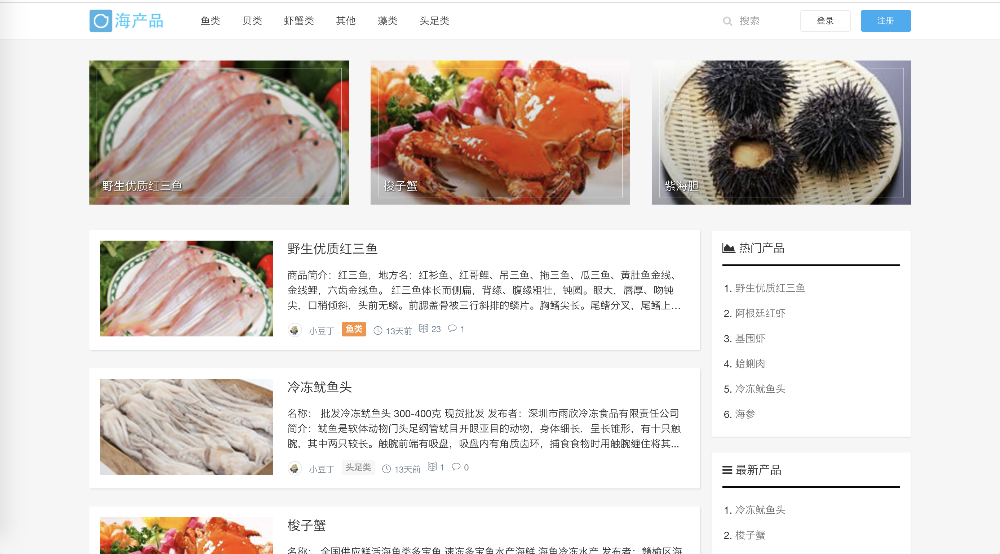

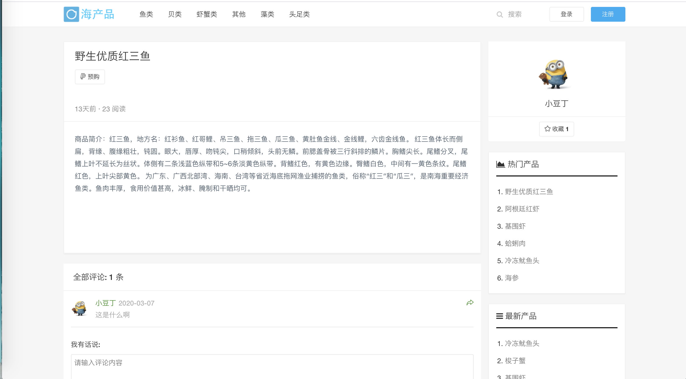

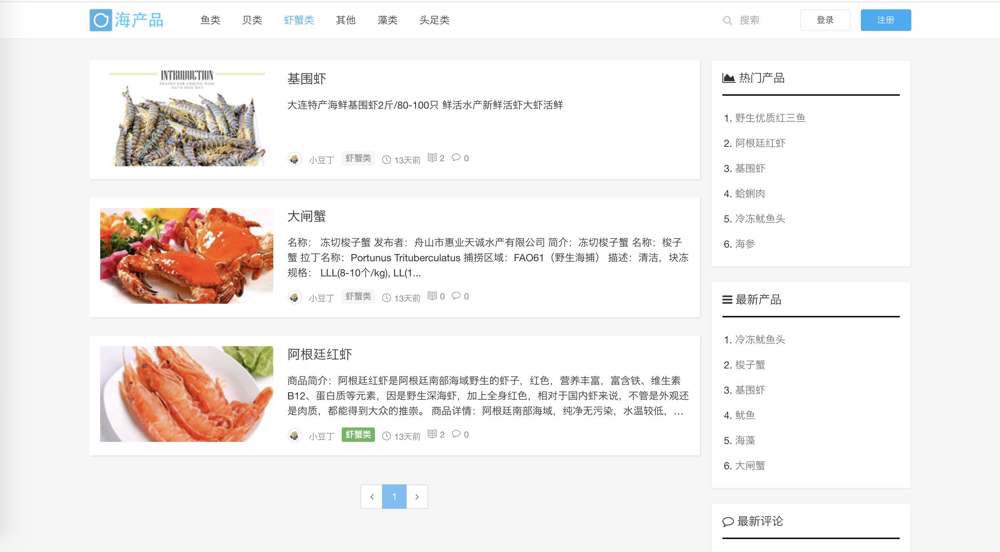

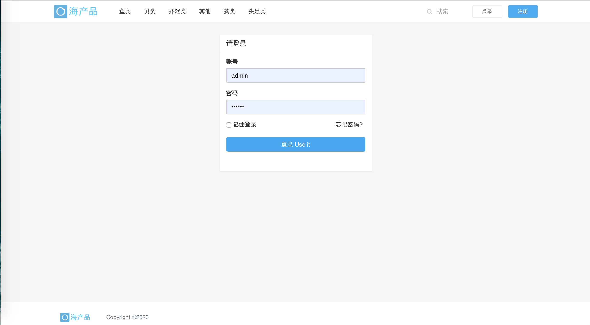

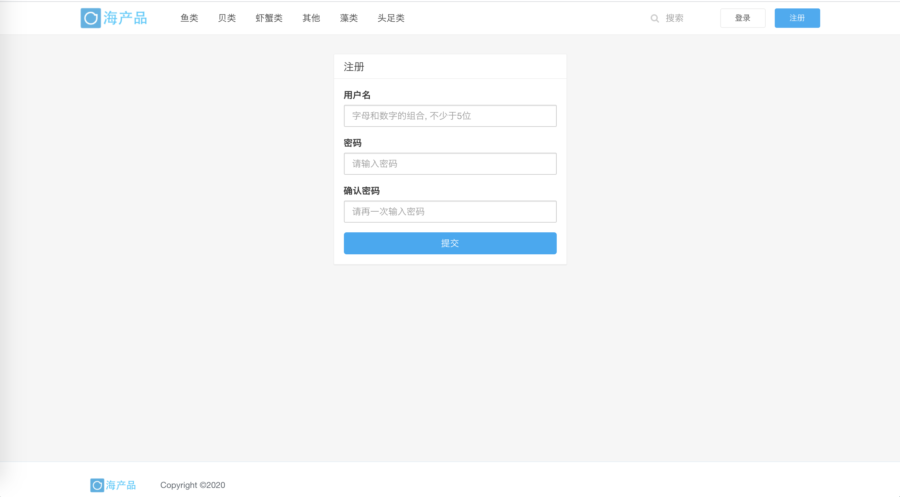

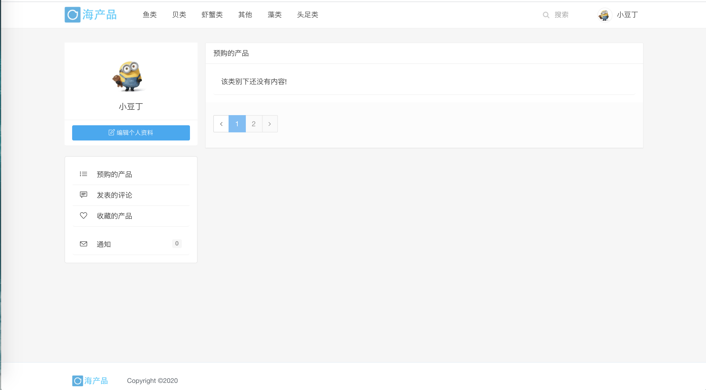

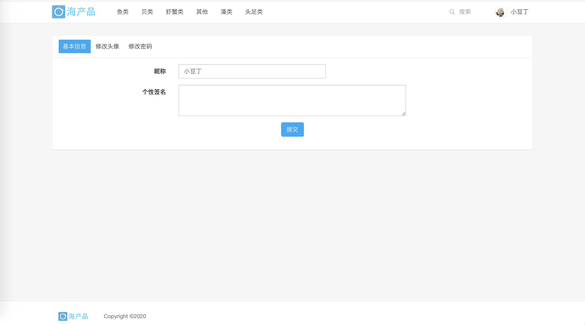

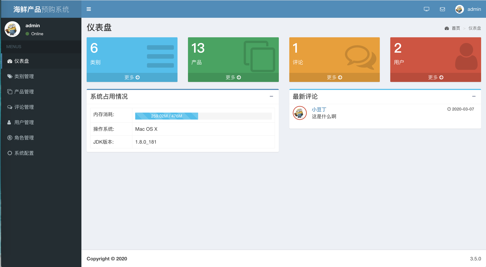

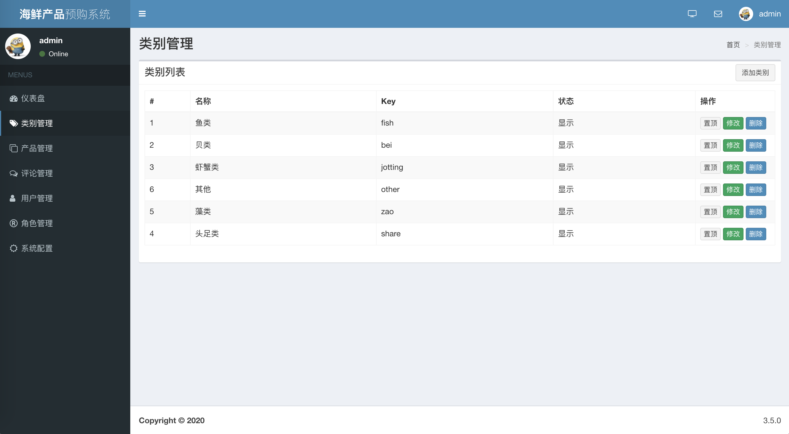

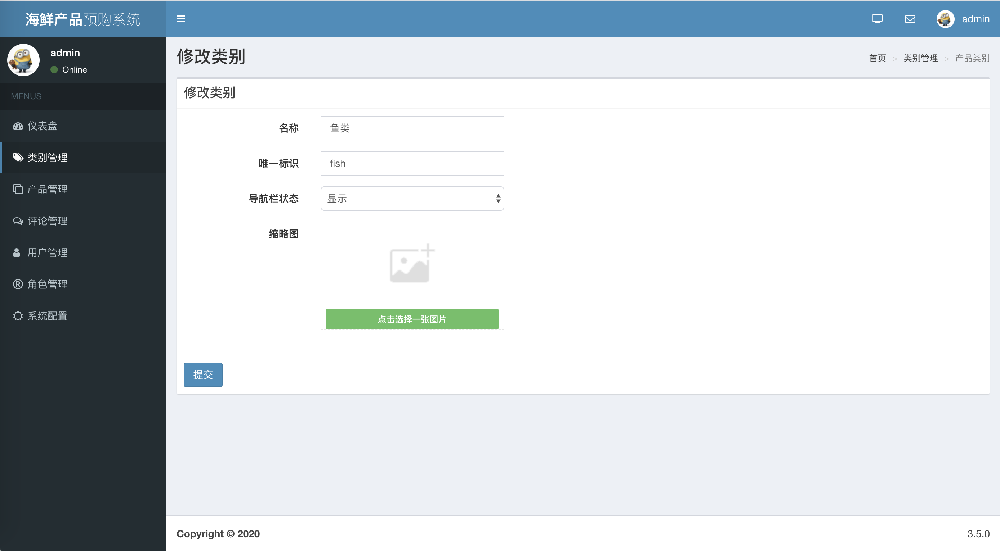

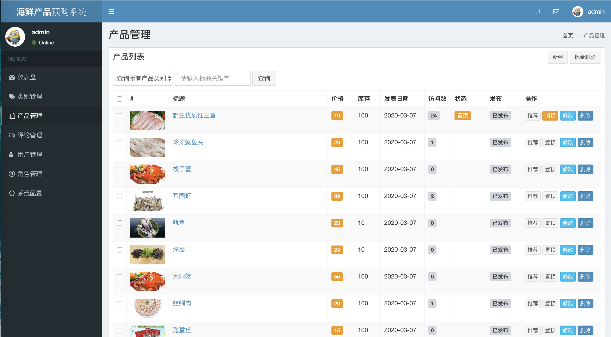

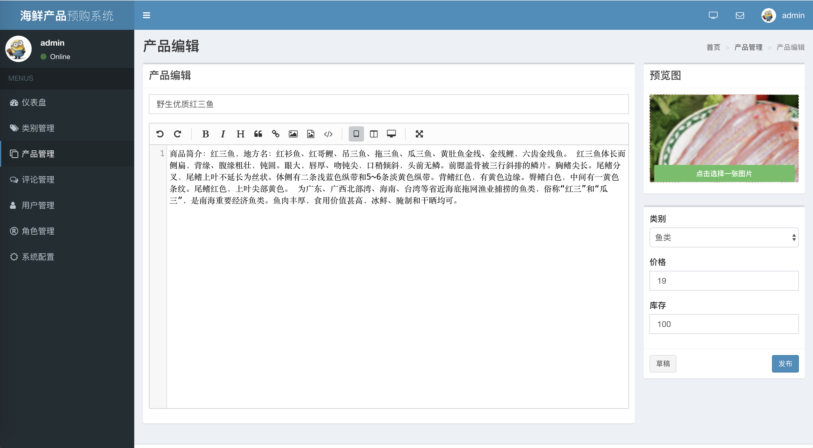

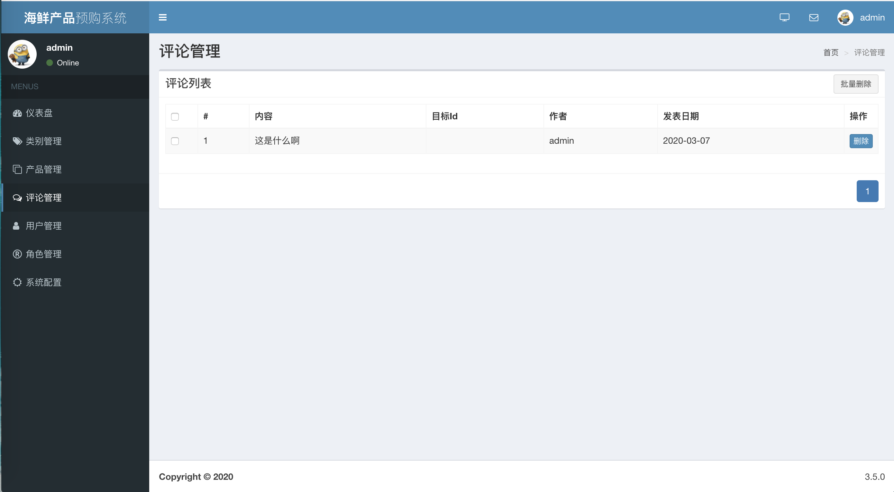

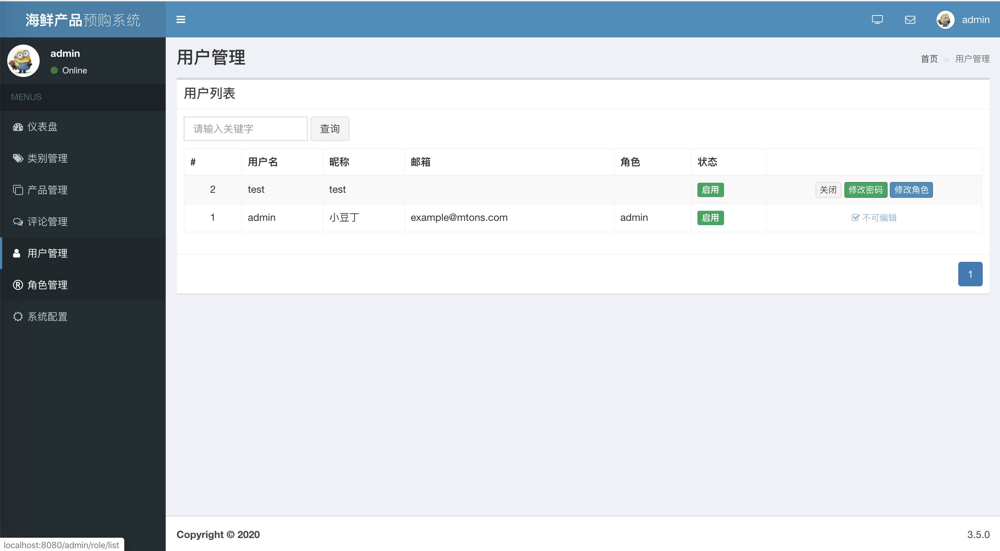

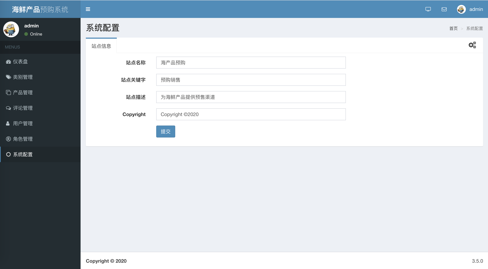